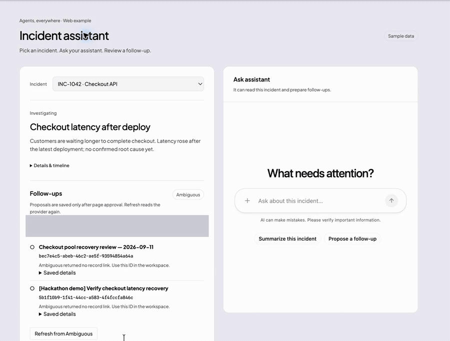

# An agent inside your web app

**OpenAI + CopilotKit React + Ambiguous AI**

Build an agent that sees the selected record or page, helps the user act on it, and creates a workplace record that remains after a refresh. Try a customer workspace, project review page, or personal planning app. Replace the sample incident domain with your own project.

[](../../assets/demos/web.mp4)

_Ask for a follow-up, approve it, and reload to find the saved task in Ambiguous. Preview at 3× speed; click for the full MP4._

## Get started

Complete the [root clone/install steps](../../README.md#get-started). Configure `.env` with [OpenAI](../../using-sponsor-tools.md#openai) and [Ambiguous AI](../../using-sponsor-tools.md#ambiguous-ai):

```dotenv
MODEL_PROVIDER=openai
OPENAI_API_KEY=your-key
MODEL=gpt-5.6-sol
AMBIGUOUS_API_KEY=your-workspace-key
```

Choose an OpenAI model your account can use. Use a demo workspace you control for the first write. This web template needs no managed Channel or Intelligence account.

To add managed conversation persistence, use the [official Intelligence onboarding prompt](../../README.md#copilotkit-onboarding) with `apps/web` as the selected app. It connects this existing Next.js/CopilotKit app; keep the Ambiguous record workflow and page approval. Saving a task in Ambiguous and persisting a conversation in Intelligence are separate capabilities.

## Realtime Sync (Intelligence)

TalentScore uses CopilotKit Intelligence for realtime conversation and thread sync. Add a project-scoped key after selecting an Intelligence project:

```dotenv
CPK_INTELLIGENCE_API_KEY=cpk_your_project_key
```

With that key, `GET /api/copilotkit/info` advertises `mode: "intelligence"`, a managed `wss://` URL, and realtime thread metadata. The existing React provider detects this automatically and switches its chat transport from SSE to WebSocket; no frontend transport or server WebSocket upgrade configuration is needed. Voice transcription, A2UI, Open Generative UI, Learning, and the human approval flow remain enabled.

For an isolated test gateway only, provide both transport planes as bare origins (never add `/api`, `/runner`, or `/client`):

```dotenv
INTELLIGENCE_API_URL=http://127.0.0.1:8788
INTELLIGENCE_WS_URL=ws://127.0.0.1:8787
```

`COPILOTKIT_API_URL` and `COPILOTKIT_WS_URL` are supported aliases. Configuring only one URL fails at startup because REST and realtime must target the same dedicated environment. The managed CopilotKit service is the supported production choice; leave both URL variables unset for it. Without an Intelligence key, the endpoint deliberately stays in SSE mode and does not claim realtime sync.

To use OpenRouter, follow the [shared provider settings](../../using-sponsor-tools.md#openrouter): set `MODEL_PROVIDER=openrouter`, `OPENROUTER_API_KEY`, and a `MODEL` slug with tool support. Keep the Ambiguous workspace key; an OpenAI key is not required for OpenRouter chat.

```bash
npm run dev:web
```

Open `http://127.0.0.1:3100` or `http://localhost:3100` and select an incident. The dev and start scripts bind the credential-backed approval server to loopback by default; keep that boundary unless you add your own authentication and trusted-origin policy.

## Try the flow

1. Ask: “What's happening here?” Check the answer against the incident currently selected.
2. Ask: “Create a follow-up for this incident.”
3. Review the page proposal. Click **Approve & save to Ambiguous** only if the fields are correct. The app should return the actual record ID and any provider link.
4. Refresh the browser. Ask the agent to retrieve the saved task by its ID from Ambiguous, or click **Refresh from Ambiguous**. Check the same record returns without creating a duplicate.
5. Repeat with **Decline** and confirm no task is created.

The result should be a retrievable Ambiguous record with the same ID after refresh. An assistant message saying it saved something is not sufficient.

## Customize these files

| Piece | File |
| --- | --- |
| App and selected record | [src/app/page.tsx](src/app/page.tsx) and [src/lib/incidents.ts](src/lib/incidents.ts) |
| Context and frontend tools | [src/components/app-control.tsx](src/components/app-control.tsx): `useAgentContext`, `select_incident`, `propose_followup`, `retrieve_followup`, and `refresh_followups` |
| Approval UI and provider reads | [src/components/workplace-followups.tsx](src/components/workplace-followups.tsx) and [src/lib/use-workplace.ts](src/lib/use-workplace.ts) |
| Server approval boundary | [src/app/api/followups/route.ts](src/app/api/followups/route.ts) and [src/lib/server/followups.ts](src/lib/server/followups.ts) |
| Ambiguous MCP adapter | [src/lib/server/workplace.ts](src/lib/server/workplace.ts), reads workspace context and saves approved tasks |
| CopilotKit React UI | [src/components/generative-ui.tsx](src/components/generative-ui.tsx) and [src/components/providers.tsx](src/components/providers.tsx) |
| Agent endpoint | [src/app/api/copilotkit/[[...path]]/route.ts](src/app/api/copilotkit/[[...path]]/route.ts), configured without raw workplace write tools |

The web chat does not receive raw Ambiguous write tools. It can propose a task and read or refresh existing records through frontend tools; the server writes only after the user clicks **Approve & save to Ambiguous**. Tool schemas come from the MCP server at write time, and returned links must come from Ambiguous rather than being invented.

## Governed interviews

TalentScore’s recruitment flow is **CV email → profile → explainable ranking → human shortlist → interview proposal → human confirmation → scheduled interview → export**.

- The agent may list applications, rankings, risks, existing interviews and published availability, then call `propose_interview`.
- It has no tool to confirm, re-schedule, cancel, invite, change a shortlist, extend an offer, hire or export.
- The `interview_proposal` card requires a recruiter to check the candidate, date/time, IANA timezone, interviewers, modality/link and consent. Its confirm button calls `POST /api/talent/interviews/:id/confirm`, protected by the local same-origin route guard.
- `GET /api/talent/interviews` is a read-only source for the calendar/Kanban. The present `simulated_local` scheduler persists a confirmed record in the configured database but creates no Google Calendar/Outlook event and sends no email.

To enable the persistent interview tools locally, configure `DATABASE_URL`, run `npm run db:migrate` (which includes `003_interviews.sql`) and restart the web app. Without that database the app deliberately does not register the server-side Talent tools; it does not pretend an interview was scheduled.

## Give this to your coding agent

```text
Read the root hackathon overview, rules, sponsor guide, and AGENTS.md.
Explain the model-only and Intelligence options in README.md's CopilotKit
onboarding section. If I choose Intelligence, follow its official onboarding
prompt for apps/web before customizing; preserve this existing integration.
Adapt apps/web to our user and workflow. Keep CopilotKit React for page context,
frontend tools, agent-rendered UI, and page approval. Use Ambiguous AI for
persistent records. Do not expose raw write tools to the web chat when the page
approval path is required. Return the real record ID/link and verify read-back
after refresh. Keep credentials server-side and enforce authorization at the
write boundary. Run npm run verify and npm run build --workspace web, then
document the live record create/read/decline checks.
```

## Verify and limits

Run `npm run verify` and `npm run build --workspace web` for local checks. Then try the create/read/decline flow with your own workspace. Offline tests cover the approval boundary and error handling; they do not make live provider calls.

[CopilotKit docs](https://docs.copilotkit.ai/) · [Sponsor authentication and first calls](../../using-sponsor-tools.md) · [Demo prompts](../../dev-docs/demo-prompts.md)
